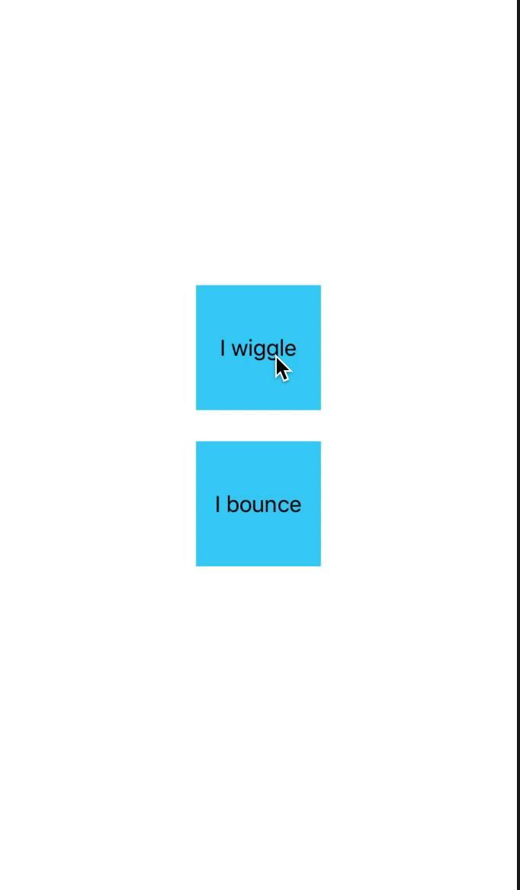

<div align="center">
    
</div>

# react-native-wiggle-box
[](https://npmjs.org/package/react-native-wiggle-box)
[](http://makeapullrequest.com)
[](https://github.com/pedreviljoen/react-native-wiggle-box/blob/master/LICENSE)
[](https://npmjs.org/package/react-native-wiggle-box) 
[](https://greenkeeper.io/)
[](https://travis-ci.org/pedreviljoen/react-native-wiggle-box)


> A box that wiggles for clickable attention

## Contents 

  - [Install](#install)
  - [Usage](#usage)
  - [Props](#props)
  - [Contribute](#contribute)
  - [License](#license)

## Install

```sh
yarn install react-native-wiggle-box
```

OR

```sh
npm install react-native-wiggle-box
```

## Usage

```javascript
import React from 'react'
import { View, Text, StyleSheet } from 'react-native'
import WiggleBox from 'react-native-wiggle-box'

class Example extends React.Component {

    handleClick = () => console.log("You've just clicked on the box")

    render() {
        <View>
            <WiggleBox
                active={true}
                handlePress={this.handleClick}
                boxStyle={styles.boxContainer}
                duration={200}
            >
                <Text>
                    I wiggle
                </Text>
            </WiggleBox>
        </View>
    }
}

const styles = StyleSheet.create({
    boxContainer: {
        backgroundColor: "#3BD0F5",
        height: 100,
        width: 100,
        alignItems: "center",
        justifyContent: "center"
    }
})
```

## Props

<table width="80%">
    <tr>
        <th>Property</th>
        <th>Description</th> 
        <th>Default Value</th>
    </tr>
    <tr>
        <td><code>active</code></td>
        <td>Boolean value toggling wiggle of box</td> 
        <td><code>false</code></td>
    </tr>
    <tr>
        <td><code>boxStyle</code></td>
        <td>Styles of box</td> 
        <td><code>{}</code></td>
    </tr>
    <tr>
        <td><code>handlePress</code></td>
        <td>Function to execute on click of the box</td> 
        <td><code>() => {}</code></td>
    </tr>
    <tr>
        <td><code>duration</code></td>
        <td>Time (ms) for duration of animation</td> 
        <td><code>100</code></td>
    </tr>
</table>

## Contribute

Contributions are welcome!

1. Fork it.
2. Create your feature branch: `git checkout -b my-new-feature`
3. Commit your changes: `git commit -am 'Add some feature'`
4. Push to the branch: `git push origin my-new-feature`
5. Submit a pull request :D

Or open up [a issue](https://github.com/pedreviljoen/react-native-wiggle-box/issues).

## License

MIT